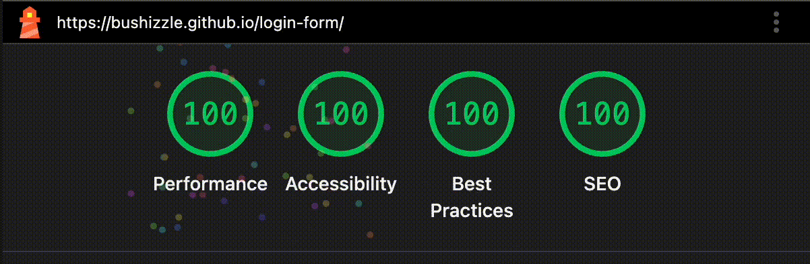

# Login Form

A polished, accessible login SPA built with React, TypeScript, and modern tooling.

## Intro (Principles)

While building this test project, I relied on three core principles:

1. **Accessibility first** — the form must be usable by everyone. Any person should be able to sign in regardless of device, input method, or assistive technology.
2. **Pleasant UX** — interacting with the form should feel smooth and friendly. That’s why it’s simple and minimalist, and why I spent time crafting a playful eye mascot that flirts, squints, reacts to the cursor, and looks away when the user types the password.
3. **Maintainable architecture** — the project structure should be clear, scalable, and easy to extend by other team members.

## Live Demo

- [Live Site](https://bushizzle.github.io/login-form/)
- [Source Code](https://github.com/bushizzle/login-form)

## Lighthouse



## Demo Credentials

- **Email**: `demo@example.com`
- **Password**: `password123`

## Getting Started

### Prerequisites

- Node.js 20+
- npm

### Installation

```bash
npm install
```

### Development

```bash
npm run dev
```

### Build

```bash
npm run build
```

### Testing

```bash
# Run tests
npm test

# Run tests with coverage
npm run test:coverage
```

### Linting

```bash
# ESLint
npm run lint

# Stylelint
npm run stylelint
```

## Architecture

This project follows **Feature-Sliced Design (FSD)** with strict import boundaries:

- **app**: Application entry point and global styles
- **pages**: Page-level components
- **widgets**: Reusable composition components (e.g. header, eye mascot)
- **features**: Business logic features (auth)
- **entities**: Domain entities (credentials)
- **shared**: Shared utilities, UI primitives, API clients

### Import Rules

- `shared` → only `shared/*`
- `entities` → `shared/*`
- `features` → `entities/*`, `shared/*`
- `widgets` → `features/*`, `entities/*`, `shared/*`
- `pages` → `widgets/*`, `features/*`, `entities/*`, `shared/*`
- `app` → everything

Never import "up" the stack.

## Decisions

### Accessibility

- All inputs have visible labels with `htmlFor` associations
- Field errors use `aria-invalid` and `aria-describedby`
- Global errors use `role="alert"` with programmatic focus
- Password visibility toggle has proper ARIA attributes
- Focus management: first invalid field on submit, global alert on auth failure
- Strong `:focus-visible` styles (never remove outline without replacement)
- Eye mascot is decorative (`aria-hidden="true"`)

### Reduced Motion

- All animations respect `prefers-reduced-motion: reduce`
- Pointer tracking disabled under reduced motion
- Animations use `transform` and `opacity` for 60fps performance

### Styling

- **CSS Modules** + **PostCSS** for component-scoped styles
- PostCSS preset-env (stage 1) with nesting and custom media
- Design tokens via CSS variables
- No UI component libraries (custom primitives only)

### Mocked API

- Realistic latency (500–900ms)
- 10% chance of network error
- Single demo credential pair succeeds
- Generic error messages (no information leakage)

## Quality Gates

### Pre-commit (Husky + lint-staged)

- ESLint on staged `.ts`, `.tsx` files (max-warnings=0)
- Stylelint on staged `.css`, `.pcss` files (max-warnings=0)

### Pre-push

- TypeScript type checking
- Test suite with coverage

### CI/CD (GitHub Actions)

- Type check
- ESLint
- Stylelint
- Test coverage (lcov)
- Coverage report to Coveralls
- Build
- Deploy to GitHub Pages (main branch)

### Coverage Thresholds

- Lines: 80%
- Functions: 80%
- Branches: 80%
- Statements: 80%

## Tech Stack

- **React 18** + **TypeScript**
- **Vite** for build tooling
- **CSS Modules** + **PostCSS** for styling
- **Vitest** + **Testing Library** for testing
- **React Hook Form** + **Zod** for form validation
- **Husky** + **lint-staged** for git hooks
- **ESLint** + **Stylelint** for code quality

## Tech Choices (Why this stack)

- **React**: required by the vacancy description and familiar to most reviewers, which makes it easier to assess both UI/UX decisions and code quality.
- **Mocked `fetch()` instead of a backend**: keeps the project fully static (ideal for GitHub Pages) while still exercising realistic request/response flows.
- **Mascot is framework-agnostic (not tied to React)**: implemented as an imperative component/class that can be mounted/unmounted. This reduces React render overhead and makes it easy to disable or replace if needed.
- **React Hook Form + Zod**: a proven, well-known combo for typed validation with minimal boilerplate. It’s also a practical choice for a test task: reliable, fast to implement, and easy to review.
- **Vite**: fast dev server/build, good TS/React experience, and easy GitHub Pages configuration.
- **Testing Library + Vitest**: modern, fast test runner with a user-centric testing approach for UI.

## License

MIT


